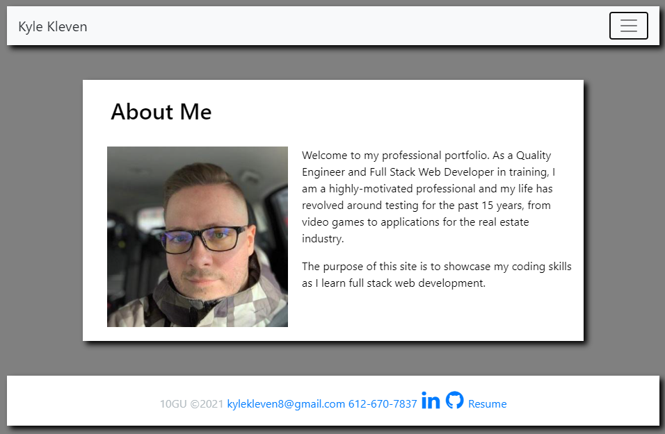
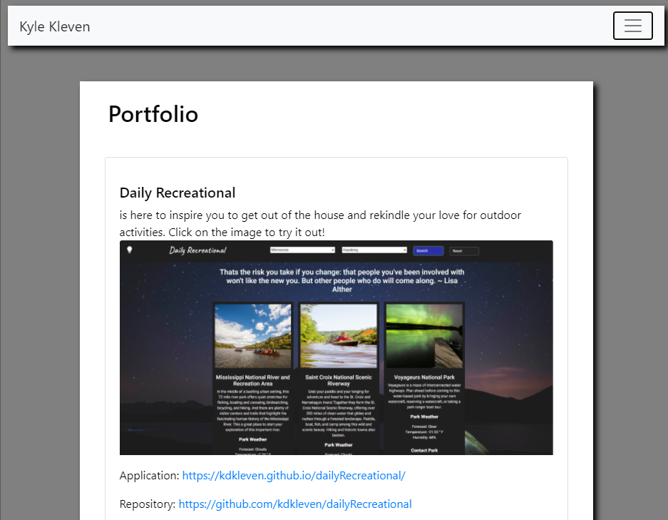

# Kyle's Portfolio

    

## Description

This is my first website designed to be responsive to desktop, tablet, and mobile devices. So, pick up your favorite device and visit my page to learn About Me, see my Portfolio, and Contact Me.
      
## Table of Contents
1. [Install Instructions](#install-instructions)
2. [Usage Instructions](#usage-instructions)
3. [License](#license)
4. [Contribution Guidelines](#contribution-guidelines)
5. [Test Instructions](#test-instructions)
6. [Questions](#questions)

## Install Instructions

No installation needed.
  
## Usage Instructions

Navigate to https://kdkleven.github.io/portfolio/

## License
  
This application is licensed under MIT License.
     

    

## Contribution Guidelines

Contributions are welcome.

## Test Instructions

No testing needed.

## Questions

If you have any questions, contact the author:  

GitHub [@kdkleven](https://github.com/kdkleven)  
Email [kylekleven8@gmail.com](mailto:kylekleven8@gmail.com)
